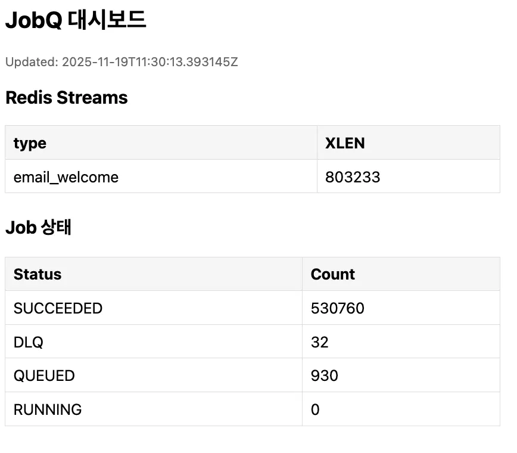

# 우테코 4주차 오픈미션 JobQ – 장애 내성을 가진 분산 작업 큐

## 목차
- [프로젝트 소개](#프로젝트-소개)
- [문제정의](#문제정의)
- [목표](#목표)
- [요구사항](#요구사항)
- [설계 원칙](#설계-원칙)
- [아키텍처/폴더 구조](#아키텍처폴더-구조)
- [도메인 모델 & 주요 컴포넌트](#도메인-모델--주요-컴포넌트)
- [API 설계 & 응답 포맷](#api-설계--응답-포맷)
- [신뢰성 설계](#신뢰성-설계-idempotency--retry--dlq--lease)
- [관측성 & 모니터링](#관측성--모니터링-metrics--admin-api)
- [성능 실험](#성능-실험)
- [리팩토링 – 공통 응답 & 에러 코드 체계](#리팩토링--공통-응답--에러-코드-체계)
- [테스트 전략](#테스트-전략)
- [실행방법 & profile 안내](#실행방법--profile-안내)
- [정리 & 도입 시나리오](#정리--도입-시나리오)
> 이 문서는 이번 오픈 미션에서 **어떻게 설계하고 구현했는지**를 최대한 자세히 정리한 기록입니다. 다소 길더라도, 설계 의도와 실험 과정까지 함께 봐 주시면 감사하겠습니다 🙇‍♀️
>
> 추가로, 주제 선정부터 이론 공부 -> 설계&계획 -> 개발 과정까지를 정리한 기록은 이래의 노션 링크에서 확인할 수 있습니다.
> 
> https://www.notion.so/4-JobQ-2a4f5968430480028eebee7bb850f9f4?source=copy_link

# 🚀 프로젝트 소개


이 프로젝트는 **장애 내성을 가진 분산 작업 큐 & 재시도 인프라**를 직접 구현해 보는 것을 목표로 진행했습니다.

그동안 간단한 웹/앱 서비스 백엔드를 만들면서 구조는 대부분 동기식 HTTP API 호출 중심이었습니다. 기능 자체는 동작했지만, 트래픽이 몰리거나 외부 API가 불안정해지는 상황에서는 재시도 폭주, 중복 처리, 지연 확대, 관측성 부족 같은 문제가 발생할 수 있다는 것을 느꼈습니다. 다만 실사용자도 거의 없고, 처음부터 아키텍처를 바꿀 여유가 없어서 실제로 이 문제들을 해결해 보지 못한 채 프로젝트를 끝낸 경우가 많았습니다.

운영체제 강의와 자료를 통해 **큐 기반 비동기 처리 모델**에 대해 이론으로는 알고 있었지만, 실제 서비스 코드에 적용해 본 적은 없었습니다. 이번 오픈 미션을 계기로, 이론으로만 알고 있던 내용을 실제 서비스에 가까운 형태로 구현해 보고자 했습니다. 예시 도메인으로는 외부 이메일 서비스에 강하게 의존하고 실패, 지연, 재시도가 자주 발생하는 **이메일 발송 Job 큐**를 선택했습니다. 이메일 발송은 재시도, DLQ, 멱등성, 관측성을 모두 실험해 보기 좋은 도메인이라고 판단했습니다.

# 🧩 문제정의


기존에 구현했던 동기식 API 기반 서비스에서는 아래와 같은 구조적 문제가 있었습니다.

1. 짧은 시간 안에 요청이 몰릴 때, 클라이언트/서버 모두에서 **재시도 폭주로 인한 트래픽 스파이크**가 발생할 수 있음
2. 같은 요청이 여러 번 전송되면 별도의 방어 장치가 없어 **중복 처리**가 일어나고, 데이터 일관성이 깨질 위험이 있음
3. 일부 요청이 느려지거나 타임아웃이 발생하면, 해당 요청이 처리 완료될 때까지 전체 응답 지연이 늘어나는 **지연 확대의** 문제가 있음
4. “어떤 요청이 몇 번 실패했고, 지금은 어떤 상태인지”를 알 수 있는 **관측 지점이 부족해**, 장애 분석과 대응이 어려웠음

사용자가 많지 않아 문제가 잘 드러나지 않았지만, 같은 구조로 실제 운영 환경에 나가면 **병목과 장애로 이어질 것**이라고 판단했습니다. 따라서 동기식 호출만으로 이루어진 구조 대신, **큐를 중심으로 한 비동기 작업 처리 인프라**를 설계하고, 재시도, DLQ, 멱등성, 관측성까지 포함한 Job 기반 처리 모델로 이 문제들을 해결해 보고자 했습니다.

# 🎯 목표

이 프로젝트에서는 단순히 “메시지를 큐에 넣고 빼는” 수준을 넘어서, 아래와 같은 요소를 모두 갖춘 **작은 Job 시스템**을 만드는 것을 목표로 했습니다.

- **Redis Streams 기반 큐**
    - Consumer Group을 이용한 수평 확장 가능 구조
- **PostgreSQL 기반 상태 저장**
    - Job 상태 전이, 재시도 횟수, lease, DLQ 등을 영속적으로 관리
- **at-least-once 처리 보장**
    - 워커 크래시/네트워크 이슈가 있어도 최소 한 번은 처리되도록 설계
- **멱등성(Idempotency)**
    - 요청 레벨 idempotencyKey로 **중복 Job 생성 방지**
    - 핸들러 레벨에서도 “같은 유저에게 이메일 두 번 보내지 않기” 같은 부작용 제어
- **재시도 & 지연 실행**
    - 지수 백오프 + 지터를 적용한 재시도 스케줄링
    - `nextAttemptAt` 기반의 예약 실행, DLQ 격리
- **관측성(Observability)**
    - Spring Actuator + Micrometer + Prometheus 노출
    - Job 상태 조회, DLQ 재처리, 실시간 대기열/상태 카운트 대시보드
    - 처리 건수/실패/재시도/DLQ 카운터 및 핸들러 처리 시간 메트릭

특히 1~3주차 미션과 달리, 이번 미션에서는 “기능이 돌아간다”를 넘어서 운영/ 신뢰성 까지 포함해서 설계하는 연습을 하는 것을 가장 큰 목표로 두었습니다. 또한 이전 미션에서 받았던 공통 피드백과 코드 리뷰 내용을 반영해, 구조, 추상화, 에러 처리 측면에서도 더 나은 코드를 작성하려고 했습니다.


# 📋 요구사항

### 기능

- [x]  HTTP API 로 이메일 발송 Job 을 등록할 수 있어야 함.
- [x]  Job 은 `QUEUED → RUNNING → SUCCEEDED / DLQ` 상태 전이를 가져야 함.
- [x]  Worker 는 큐에서 Job 을 가져와 at-least-once 방식으로 처리해야 함.
- [x]  Job 처리 실패 시, 지수 백오프 + 지터를 적용해 `nextAttemptAt` 을 계산하고 재시도해야 함.
- [x]  최대 재시도 횟수를 초과한 Job 은 DLQ(Dead Letter Queue)로 이동해야 함.
- [x]  `idempotencyKey` 를 이용해 동일 요청에 대한 중복 Job 생성을 막아야 함.
- [x]  관리자용 API 로 DLQ Job 재실행이 가능해야 함.
- [x]  Job 상태별 카운트(QUEUED/RUNNING/SUCCEEDED/DLQ)를 조회할 수 있는 엔드포인트 또는 화면을 제공해야 함.

### 비기능

- [x]  외부 이메일 API 실패/타임아웃 시에도 Job 은 큐/DB 에 저장되어 유실되지 않아야 함.
- [x]  처리량, 실패율, 재시도 횟수, DLQ 크기, 핸들러 처리 시간 등의 메트릭을 Actuator/Micrometer 로 노출해야 함.
- [x]  큐 구현체는 Redis Streams 기반이지만, `JobQueuePort` + `RedisStreamsQueueAdapter` / `InMemoryQueueAdapter` 로 교체 가능한 구조여야 함.
- [x]  In-memory 큐/테스트 더블을 활용해 정상 처리·재시도·DLQ 이동 시나리오를 자동화 테스트로 검증할 수 있어야 함.
- [x]  k6 스크립트를 활용해 스모크 테스트와 벤치마크 테스트를 수행할 수 있어야 함.

# 🧭 설계 원칙


요구사항을 만족시키기 위해 다음과 같은 설계 원칙을 세웠습니다.

- **큐 추상화 우선**
    - 애플리케이션/도메인 로직은 특정 기술(Redis Streams)에 직접 의존하지 않고, `JobQueuePort` 인터페이스에 의존.
    - 실제 구현은 `RedisStreamsQueueAdapter`, 테스트용 구현은 `InMemoryQueueAdapter` 가 담당함.
- **도메인 / 인프라 분리**
    - Job 상태 모델, 멱등성, Backoff 규칙 등 핵심 규칙은 `domain` / `application` 계층에 둠.
    - Redis, Postgres, 스케줄러, 워커 러너 등 외부 연동은 `infra` 계층에서 담당.
- **at-least-once + 멱등성 조합**
    - 전달 보장은 at-least-once 로 가져가되, 중복 실행에 따른 부작용은 멱등성(`JobIdempotency`, 핸들러 로직)으로 제어.
- **운영을 먼저 생각하는 설계**
    - 재시도, DLQ, 관리자 API, 메트릭을 “나중에 붙이는 옵션”이 아니라 처음부터 **핵심 플로우의 일부**로 포함. 즉 처음부터 나중의 구현의 생각하며 확장적으로 개발.
- **관측 가능한 시스템**
    - 로그, 메트릭, 관리자 화면을 통해 “잘 될 것 같다”가 아니라 **실제로 어떻게 동작하는지 보이는 구조**를 목표
- **테스트&벤치마크**
    - In-memory 구현체, 통합 테스트, k6 스크립트를 활용해 로컬에서도 장애/부하 시나리오를 반복적으로 재현 및 검증할 수 있도록 함.

# 📂아키텍처/폴더 구조

```
├── k6/                                           # k6 부하/스모크 테스트 스크립트
│   ├── outputs/                                 # k6 실행 결과(json) 출력 폴더
│   ├── post-jobs-benchmark-v2.js                # 이메일 Job 대량 트래픽 벤치마크 스크립트
│   └── post-jobs-smoke.js                       # 기본 동작 확인용 스모크 테스트 스크립트
│
├── src/
│   ├── main/
│   │   ├── java/com/yerin/jobq/
│   │   │   ├── application/                     # 유스케이스/핸들러 계층 (JobHandler, EmailWelcomeHandler 등)
│   │   │   ├── config/                          # 스프링/인프라 설정(@Configuration)
│   │   │   ├── controller/                      # REST 컨트롤러 (Admin API 등 진입 지점)
│   │   │   ├── domain/                          # Job/메트릭 등 핵심 도메인 모델
│   │   │   ├── dto/                             # 요청/응답 DTO
│   │   │   ├── global/
│   │   │   │   ├── dto/                         # 공통 응답 포맷(BaseResponse, ErrorResponse 등)
│   │   │   │   └── exception/                   # 공통 예외, 에러 코드, 예외 핸들러
│   │   │   ├── infra/                           # Redis Streams 어댑터, WorkerRunner, Backoff 등 인프라 계층
│   │   │   ├── repository/                      # JPA 리포지토리 인터페이스
│   │   │   ├── service/                         # 애플리케이션 서비스(Enqueue, AdminJob 관리 등)
│   │   │   ├── web/                             # 웹 레이어 공통 컴포넌트(인터셉터 등)
│   │   │   └── JobqApplication.java             # Spring Boot 메인 클래스
│   │   │
│   │   └── resources/
│   │       ├── db.migration/                    # Flyway 마이그레이션 스크립트
│   │       ├── static/                          # 정적 리소스(관리자 대시보드 HTML 등)
│   │       ├── application.yml                  # 기본 프로파일 설정
│   │       ├── application-local.yml            # 로컬 개발용 설정
│   │       ├── application-perf.yml             # 성능 측정 공통 설정
│   │       └── ...                              # 기타 perf-a, perf-b, perf-c 등 프로파일
│   │
│   └── test/
│       ├── java/com/yerin/jobq/
│       │   ├── domain/                          # 도메인 단위 테스트
│       │   ├── infra/                           # Backoff 등 인프라 로직 테스트
│       │   ├── service/                         # Enqueue/관리자 서비스 단위 테스트
│       │   ├── support/                         # 통합/E2E 테스트 지원 클래스 모음
│       │   ├── web/                             # 컨트롤러/인터셉터 테스트
│       │
│       └── resources/
│           └── application-test.yml             # 테스트용 애플리케이션 설정
│
└── build.gradle / README.md / ...               # 빌드 스크립트 및 문서
```

이전에는 `controller`, `service`, `domain`, `repository`, `dto` 정도의 비교적 단순한 레이어드 구조만 사용했습니다. 하지만 이번에는 역할을 더 명확히 나눈 구조를 도입했습니다.

# 🧠 도메인 모델 & 주요 컴포넌트


이 프로젝트에서는 “Job 큐”를 단순한 메시지 단위가 아니라, 상태 전이와 재시도, DLQ, 멱등성까지 포함한 하나의 도메인으로 보고 설계했습니다.

### 도메인 모델

도메인 모델은 **Job(작업 단위)** 를 중심으로, **이력/멱등성/큐 포트/메트릭스** 를 별도 엔티티와 컴포넌트로 분리하여 구성했습니다.

- **Job**

  이메일 발송과 같은 하나의 작업을 표현하는 핵심 엔티티로, 타입, 페이로드, 상태, 재시도 횟수, `nextAttemptAt`, lease 정보 등을 함께 가지도록 했습니다.


- **JobStatus**

  `QUEUED / RUNNING / SUCCEEDED / DLQ` 네 가지 상태로 정의해, 운영·모니터링에서 그대로 사용할 수 있도록 했습니다.


- **JobEventLog**

  Job 의 상태 변화와 실패 이유를 시간 순으로 남기는 이벤트 로그 엔티티로 설계해, “언제 어떤 이유로 실패/재시도/ DLQ 이동이 있었는지”를 추적할 수 있도록 했습니다.


- **JobIdempotency**

  `(type, idempotencyKey)` 조합을 유니크하게 저장해, 같은 요청이 여러 번 들어와도 Job 이 중복 생성되지 않도록 했습니다.


- **JobqMetrics**

  Job 상태별 카운트(대기/성공/실패/DLQ)를 한 번에 담는 읽기 전용 모델로 두어, 관리 API와 대시보드에서 재사용하도록 했습니다.


- **JobQueuePort**

  큐 연동을 추상화한 포트 인터페이스로, Job 저장/완료/재시도/ DLQ 이동 등을 메서드로 정의하고, 실제 구현은 `infra` 계층이 맡도록 했습니다.


### 애플리케이션 서비스 & 핸들러

애플리케이션 계층에서는 도메인 모델을 이용해 **Job 생성, 재시도, 핸들러 디스패치** 를 담당하는 서비스와 핸들러들을 구현했습니다.

- **EnqueueJobService**

  클라이언트의 Job 생성 요청을 처리하는 서비스로, `JobIdempotency` 를 먼저 조회하고 없을 때만 새 Job 을 만들고 큐에 넣도록 했습니다.


- **AdminJobService**

  DLQ 로 간 Job 을 다시 큐에 태우는 재실행(replay) 기능을 제공하도록 했습니다.


- **JobHandler**

  Job 타입별 실제 작업을 수행하는 공통 인터페이스로, `(jobId, type, payloadJson)` 을 받아 비즈니스 로직을 실행하도록 했습니다.


- **JobHandlerRegistry**

  `type → JobHandler` 매핑을 담당하는 레지스트리로, 워커가 Job 타입만 보고 적절한 핸들러를 찾을 수 있도록 했습니다.


- **EmailWelcomeHandler**

  “환영 이메일 발송 Job” 예시 핸들러로 구현해, 의도적인 실패 옵션 등을 넣어 재시도·DLQ 동작을 검증할 수 있도록 했습니다.


### 인프라 계층 (infra)

Redis Streams, 스케줄러, 워커 실행, 백오프 계산, 테스트용 인메모리 큐 등을 이 계층에서 담당하도록 했습니다.

- **RedisStreamsQueueAdapter**

  `JobQueuePort` 의 Redis Streams 구현체로, `XADD / XREADGROUP / XACK` 를 사용해 스트림에 적재 및 사용하도록 했습니다. 메시지에는 최소 필드만 담고, 나머지 상태는 DB(JPA)에서 관리하도록 했습니다.


- **InMemoryQueueAdapter**

  로컬 개발·테스트용 큐 구현으로, Redis 없이도 기본 플로우를 검증할 수 있도록 했습니다.


- **WorkerRunner**

  Redis 에서 Job 을 읽어 핸들러를 실행하는 워커 컴포넌트로, 메시지 수신 → Job 조회 → lease 설정 → 상태 RUNNING → 핸들러 실행 → 성공 시 SUCCEEDED + ACK, 실패 시 재시도/DLQ 로 전이하도록 했습니다.


- **DueJobEnqueuer**

  `nextAttemptAt <= now` 인 Job 을 주기적으로 찾아 Redis 큐에 다시 넣어, 재시도·예약 실행·지연 실행을 하나의 메커니즘으로 처리하도록 했습니다.


- **LeaseReaper**

  `leaseExpiresAt` 이 지난 Job 을 다시 `QUEUED` 로 되돌리는 역할을 해, 워커 크래시 등으로 RUNNING 상태에 멈춰 있는 Job 을 복구하도록 했습니다.


- **Backoff**

  지수 백오프 + 지터를 적용해 다음 재시도 시각을 계산하는 유틸로, 같은 시점에 재시도가 몰리지 않도록 했습니다.


- **WorkerId**

  호스트명 + UUID 기반으로 컨슈머 이름을 생성해, 여러 인스턴스가 떠 있어도 서로 다른 워커로 인식되도록 했습니다.


### Web / Controller 계층

- **JobController**

  `/jobs/{type}` 로 Job 생성, `/jobs/{id}` 로 Job 조회를 제공하고, `EnqueueJobService` 와 `JobRepository` 를 호출해 `DataResponse` 형식으로 응답하도록 했습니다.


- **AdminJobController**

  `/admin/jobs/{id}/replay` 로 DLQ Job 재실행 기능을 제공하고, `AdminJobService` 결과를 `DataResponse<JobResponse>` 로 반환하도록 했습니다.


- **AdminMetricsController**

  `/admin/metrics/queue`, `/admin/metrics/jobs` 에서 Redis Streams 상태와 Job 상태별 카운트를 단순 JSON 으로 반환해, `curl`, `jq`, k6, HTML 대시보드에서 바로 사용 가능하도록 했습니다.


- **AdminTokenInterceptor**

  `/admin/**` 요청의 `X-Admin-Token` 헤더를 검사해, 설정된 토큰과 다르면 401 을 반환하는 간단한 운영자 보호 장치로 두었습니다.


### Repository 계층

- **JobRepository**

  JPA 기반으로 Job 엔티티를 저장·조회하고, 상태별 카운트 조회, 재시도 대상 조회 등 도메인 용어를 그대로 쓴 쿼리 메서드를 제공하도록 했습니다.


### Global & 설정

- **Global**

  `BaseResponse`, `DataResponse`, `ErrorResponse`, `AppException`, `ExceptionController` 로 공통 응답 포맷과 예외 처리를 통일해, 클라이언트와 운영자가 일관된 형태의 응답을 보도록 했습니다.

- **DB & 설정**

  `db.migration` 에서 Job, JobEventLog, JobIdempotency 등 스키마를 Flyway로 관리했고, `application-local.yml`, `application-perf[-a/b/c].yml` 로 로컬·성능 테스트용 프로파일을 나누어 실행 환경을 분리했습니다.


# 🔌 API 설계 & 응답 포맷

이 프로젝트에서는 **일반 클라이언트가 사용하는 Job API**와

**운영자가 사용하는 Admin API**를 분리해서 설계했습니다.

- `/jobs`, `/admin/jobs/**`
    - **도메인 기능을 제공하는 API**로 보고 `DataResponse` / `ErrorResponse` 기반의 **공통 응답 포맷**을 적용했습니다.

- `/admin/metrics/**`
    - **운영/모니터링용 내부 엔드포인트**로 보고 스크립트에서 바로 값을 읽기 쉽도록 **단순 JSON 구조를 유지**했습니다. (공통응답 적용 X)


## 공개 Job API (`JobController`)

`JobController` 는 “이메일 발송 Job 큐”를 사용하는 **일반 클라이언트용 API**로 설계했습니다.

- POST `/jobs/{type}`
    - 역할
        - 이메일 발송 등 하나의 Job 을 큐에 적재하는 엔드포인트로 설계했습니다.
        - URL 의 `{type}` path variable 로 Job 타입을 받고 요청 바디의 `idempotencyKey` 를 기반으로 **멱등하게 Job 을 생성**하도록 했습니다.

        - 같은 `{type}` + `idempotencyKey` 조합이 이미 존재하면, **새로 만들지 않고 기존 Job 의 id 를 그대로 반환**합니다.
    - 요청 예시
        - path: `/jobs/email_welcome`
        - body 예시

        ```json
        {
          "userId": 42,
          "idempotencyKey": "user#42#welcome"
        }
        ```

    - 응답
        - `DataResponse<Map<String, String>>` 형태로, `{"jobId": "<생성(또는 재사용)된 Job ID>"}` 만 단순하게 반환하도록 했습니다.
  

- **GET `/jobs/{id}`**
    - 역할
        - 특정 Job 의 **현재 상태와 기본 정보**를 조회하는 엔드포인트로 설계했습니다.
        - 큐에 넣은 Job 이 지금 어떤 상태인지 (`QUEUED` / `RUNNING` / `SUCCEEDED` / `DLQ`) 확인할 수 있도록 했습니다.
    - 동작
        - `JobRepository.findById(id)` 로 Job 을 조회하고,
        - 없으면 `JobErrorCode.JOB_NOT_FOUND` 로 `AppException` 을 던지도록 구현했습니다.
        - 있으면 `JobResponse.from(job)` 으로 DTO 변환 후 공통 응답에 감싸서 반환합니다.
    - 응답
        - `DataResponse<JobResponse>` 형태로, `status`, `nextAttemptAt`, `lastErrorMessage` 등 Job 의 현재 상황을 한 번에 파악할 수 있도록 했습니다.

## Admin API (`AdminJobController`, `AdminMetricsController`)

운영자용 API 는 `/admin/**` 아래로 모으고, `AdminTokenInterceptor` 를 통해 **헤더 기반 토큰 인증**을 거치도록 설계했습니다.

- 모든 `/admin/**` 요청에 대해 `X-Admin-Token` 헤더를 검사하고,
- 설정된 admin 토큰과 다르면 401 Unauthorized 를 반환해서 일반 클라이언트가 Admin API 를 호출하지 못하도록 했습니다.
- `AdminJobController` → **도메인(Job 시스템) 관리 기능** (재실행 등)
- `AdminMetricsController` → **운영/모니터링 조회 기능**

### Job 관리 API (`AdminJobController`)

`AdminJobController` 는 일반 사용자가 아니라, **운영/관리 콘솔에서 사용하는 Job 관리 API**입니다.

다만 “도메인(Job) 조작”에 가깝기 때문에 `/jobs` 와 마찬가지로 **공통 응답 포맷**을 적용했습니다.

- POST `/admin/jobs/{id}/replay`
    - 역할
        - DLQ 로 떨어졌거나 실패한 Job 을 다시 큐에 태우기 위한 **재실행 엔드포인트**로 설계했습니다.
        - 내부적으로 `AdminJobService.replay(id)` 를 호출해, Job 을 찾아 상태를 초기화하고 재시도 횟수/예약 시각 등을 재설정한 뒤 다시 처리 대상으로 되돌리도록 구현했습니다.
    - 인증
        - `@RequestHeader("X-Admin-Token")` 으로 관리자 토큰을 받지만,
        - 실제 검증 로직은 `AdminTokenInterceptor` 에서 수행합니다.
        - 컨트롤러 메서드는 인터셉터를 통과한 요청만 온다고 가정하고, 바로 비즈니스 로직에 집중하도록 했습니다.
    - 응답
        - `DataResponse<JobResponse>` 형태로, 재실행 대상이 된 Job 의 정보를 그대로 반환하도록 했습니다.

### 메트릭/상태 조회 API (AdminMetricsController)

AdminMetricsController 는 **운영/모니터링용 내부 API**로 설계했습니다.

여기는 `curl`, `jq`, k6 스크립트 등에서 바로 값을 뽑아 쓰는 것이 중요하다고 판단해, **공통 응답 래퍼를 적용하지 않고 순수 JSON 구조**를 유지했습니다.

또한 구현해놓은 `/resources/static/dashboard.html` 에서 `/admin/metrics/*` 를 호출해 테이블을 갱신합니다.


- GET `/admin/metrics/queue`
    - 역할
        - Redis Streams 및 내부 큐 상태를 한 번에 확인하는 엔드포인트로 설계했습니다.
        - 스트림별 메시지 수, pending 정보, consumer group 상태 등을

          `Map<String, Object>` 형태로 반환하도록 구현했습니다.


- GET `/admin/metrics/jobs`
    - 역할
        - DB 에 저장된 Job 들의 **상태별 카운트**를 조회하는 엔드포인트입니다.
        - `QUEUED`, `RUNNING`, `SUCCEEDED`, `DLQ` 개수를 `Map<String, Long>` 형태로 반환합니다.

## 응답 포맷 설계 (`BaseResponse`, `DataResponse`, `ErrorResponse`)

- `BaseResponse`
    - 모든 응답의 공통 상위 타입으로 두고,
    - “성공/실패 여부”, “응답 코드/메시지” 등 공통 필드를 묶어두는 역할을 하도록 했습니다.
- `DataResponse<T>`
    - 성공 응답에서 사용하는 제네릭 래퍼로 설계했습니다.
    - 응답 바디 예시

        ```json
        {
          "status": "string",
          "timestamp": "2025-11-20T13:16:31.101Z",
          "data": {
            "id": 9007199254740991
          }
        }
        ```

- `ErrorResponse`
    - 예외 발생 시 사용하는 에러 응답 타입으로 설계했습니다.
    - 예외는 `ErrorCode` enum 과 매핑하고, 유효성 검증 실패나 404, 500 등 상황에 맞는 코드/메시지를 보이도록 했습니다.
    - 예외 바디 예시

        ```json
        {
          "code": "JOB-002",
          "message": "DLQ 상태의 작업만 재실행할 수 있습니다.",
          "method": "POST",
          "requestURI": "/admin/jobs/33/replay",
          "status": "Bad Request",
          "timestamp": "2025-11-20 22:17:30"
        }
        ```


# 🛡️신뢰성 설계 (Idempotency / Retry / DLQ / Lease)

이 프로젝트에서는 “한 번 넣은 Job 이 어떻게 해서든 처리되고, 중복/유실/폭주를 막는다”는 목표로 멱등성, 재시도, DLQ, lease 를 함께 설계했습니다.

### 멱등성(Idempotency)

- `JobIdempotency` 엔티티에 `(type, idempotencyKey)` 를 저장하고 유니크 제약을 두어, `EnqueueJobService` 가 같은 키로 요청이 여러 번 들어와도 **하나의 Job 만 생성되도록** 했습니다.
- `EmailWelcomeHandler` 는 외부 이메일 API에서 발급된 메시지 ID가 이미 저장되어 있으면 바로 리턴하도록 구현해, 같은 Job 이 여러 번 소비되어도 이메일이 두 번 보내지지 않도록 했습니다.

### 재시도 & 백오프

- `WorkerRunner` 가 핸들러 실행 중 예외가 나면 Job 의 `attempts` 를 증가시키고, `Backoff` 유틸로 **지수 백오프 + 지터**를 계산해 `nextAttemptAt` 에 저장했습니다.
- `DueJobEnqueuer` 가 `nextAttemptAt <= now` 인 Job 을 찾아 Redis Streams 로 다시 밀어 넣어, “지정된 시간 이후에만 재시도”되도록 했습니다.
- 설정한 최대 시도 횟수(`maxRetries`)를 넘기면 더 이상 재시도하지 않고, DLQ 로 보내도록 했습니다.

### DLQ(Dead Letter Queue)

- RedisStreamsQueueAdapter 에서 DLQ 전용 스트림 키(`{prefix}:dlq:{type}`)를 분리해 운영했습니다.
- `WorkerRunner` 는 재시도 한도를 넘기거나 복구 불가능한 오류라고 판단되면,
    - DB 상 Job 상태를 `DLQ` 로 변경하고
    - 원본 스트림에서 ACK 한 뒤
    - DLQ 스트림으로 메시지를 복사하도록 구현했습니다.
- `AdminJobService.replay` 가 DLQ 상태 Job 을 다시 `QUEUED` 로 되돌리고 스트림에 재 적재해, 운영자가 필요할 때 수동으로 재처리할 수 있도록 했습니다.

### Lease & stuck 방지

- `Job` 엔티티에 `leasedBy`, `leaseExpiresAt` 를 두고, Worker 가 Job 을 집어올 때 **lease 를 선점**하도록 했습니다.
- 같은 Job 에 여러 워커가 경쟁할 경우, DB 의 `leaseIfQueuedOrRunning` 쿼리 결과를 보고 선점에 성공한 워커만 실제 처리를 진행하게 했습니다.
- `LeaseReaper` 가 `leaseExpiresAt < now` 인 Job 을 주기적으로 다시 `QUEUED` 로 돌려보내, 워커 크래시 등으로 RUNNING 상태에 영원히 멈춰 있는 Job 이 없도록 했습니다.

# 📈 관측성 & 모니터링 (Metrics / Admin API)


“Job 이 잘 돌아가고 있는지, 어디서 막히는지”를 눈으로 확인할 수 있도록 **로그 + 도메인 메트릭 + 운영용 Admin API + 간단 대시보드** 조합으로 하였습니다.

### 도메인 메트릭

- Job 상태별 카운트는 `JobRepository.countByStatus(JobStatus.*)`로 집계하도록 했습니다.
- `AdminMetricsController`의 `/admin/metrics/jobs`에서 `QUEUED`, `RUNNING`, `SUCCEEDED`, `DLQ` 개수를 `Map<String, Long>` 형태로 내려주도록 했습니다.

- 이를 통해 대기열 적체, DLQ 급증 여부 등을 한눈에 확인할 수 있도록 했습니다. 또한 `JobEventLog` 엔티티를 두었습니다.

### 큐(Redis Streams) 상태 메트릭

- Redis Streams 상태는 `/admin/metrics/queue`에서 조회하도록 했습니다.
- 이를 통해 워커가 큐를 따라잡고 있는지, 메시지가 비정상적으로 쌓이는지 바로 확인할 수 있도록 했습니다.

### Actuator / Micrometer

- 애플리케이션 레벨 메트릭은 Spring Actuator + Micrometer 로 노출하도록 했습니다.
- HTTP 요청 수, 응답 시간, JVM/DB 상태 등은 `/actuator/**`·`/actuator/prometheus`에서 확인 가능하도록 설정했습니다.
- 도메인 메트릭(`/admin/metrics/*`)과 Actuator 메트릭을 함께 사용해

  “시스템 자원”과 “Job 큐 동작”을 동시에 관찰할 수 있도록 했습니다.


### Admin Metrics API와 대시보드

- `/admin/metrics/**`는 운영/모니터링용 내부 엔드포인트로 설계했습니다.
- `src/main/resources/static/dashboard.html`에서 `/admin/metrics/queue`, `/admin/metrics/jobs`를 주기적으로 호출해 테이블을 갱신하는 간단한 관리용 대시보드를 추가했습니다.
    - 로컬에서 http://localhost:8080/dashboard.html로 접속해서, 상태별 Job 카운트 변화와 큐 길이(xlen)의 증감 을 브라우저에서 바로 확인할 수 있도록 했습니다.

# ⚡ 성능 실험

- **profile 별 워커 설정 + DB I/O 절감 적용 여부** 에 따라 성능을 비교했고, k6 스크립트를 이용해 **HTTP 평균 지연, p95 지연, iteration_duration p95, 처리량(요청 수)**를 확인했습니다.

### 실험 방법

- `k6/post-jobs-benchmark-v2.js` 스크립트를 사용해 `/jobs/{type}`에 대량 요청을 보내도록 했습니다.
- 각 profile별로 애플리케이션을 실행하고 k6를 실행해 `k6/outputs/*.json`으로 저장하도록 했습니다. (깃허브에도 올라와있음)
- 비교 지표
    - `http_req_duration` 평균/95백분위(ms)
    - `iteration_duration` p95(ms)
    - 총 요청 수(throughput)

### 프로파일 구성

`application-*.yml`을 나누어 워커 동시성·배치 설정을 바꾸었습니다.

| 프로파일 | 설명 |
| --- | --- |
| `local` (baseline) | 기본 설정 (적당한 동시성/배치) |
| `perf-a` | 낮은 배치 + 중간 동시성 |
| `perf-b` | 중간 배치 + 중간 동시성, block 시간 짧게 |
| `perf-c` | 단일 워커 + 낮은 배치(비교용 대조군) |

### 1차 비교(baseline vs perf-a/b/c (DB I/O 절감 전))

| 프로파일 | HTTP avg (ms) | HTTP p95 (ms) | iter_duration p95 (ms) | 요청 수 |
| --- | --- | --- | --- | --- |
| **baseline** | **9.15** | **13.69** | **213.98** | **40069** |
| **perf-a** | 9.46 | 19.25 | 220.27 | 39943 |
| **perf-b** | 9.66 | 20.26 | 221.43 | 39917 |
| **perf-c** | **8.96** | **17.91** | **218.94** | **40054** |
- 평균 지연은 **perf-c가 가장 낮게** 나왔고, 처리량도 네 프로파일이 거의 비슷했습니다.
- tail 구간(p95)은 baseline 이 가장 좋았지만, perf-a/b 에 비해서는 perf-c 가 더 나은 편이었습니다.

→ 결과적으로, 추가 튜닝 비교 대상을 perf-c로 선택했습니다.

### DB I/O 절감 설계

- **DB I/O를 줄이는 리팩토링**을 도입했습니다.
- 기존에는 상태 전이를 `findById() → 엔티티 수정 → save()` 패턴으로 처리했지만, **단일 UPDATE 쿼리**로 바꾸어, 같은 Job 을 여러 번 읽고 쓰는 오버헤드를 줄이도록 했습니다.
- 이렇게 수정한 뒤, baseline vs perf-c 두 프로파일을 각각 3회씩 실행해 평균을 비교했습니다.

| 프로파일 | HTTP avg (ms) | HTTP p95 (ms) | iter_duration p95 (ms) | 요청 수(평균) |
| --- | --- | --- | --- | --- |
| baseline (도입 후) | 8.35 | 16.09 | 216.98 | 40173 |
| perf-c (도입 후) | 8.45 | 16.57 | 217.42 | 40150 |
- 평균 지연 / p95 / iteration_duration p95 모두 두 프로파일이 거의 비슷한 수준이었습니다.

### DB I/O 도입 전·후 비교

| 프로파일 | 시점 | HTTP avg (ms) | HTTP p95 (ms) | iter_duration p95 (ms) | 요청 수(평균) |
| --- | --- | --- | --- | --- | --- |
| baseline | 도입 전 | 9.15 | 13.69 | 213.98 | 40069 |
| baseline | 도입 후(3회 평균) | 8.35 | 16.09 | 216.98 | 40173 |
| perf-c | 도입 전 | 8.96 | 17.91 | 218.94 | 40054 |
| perf-c | 도입 후(3회 평균) | 8.45 | 16.57 | 217.42 | 40150 |
- DB I/O 절감 도입 후, **평균 지연은 전반적으로 조금 개선**되는 경향을 보였습니다.
- iteration_duration p95, 처리량은 두 시점 모두 큰 차이가 없지만, DB I/O의 절감 도입이 대량 재시도 상황에서는 이득을 볼 수 있을 것 같다고 해석했습니다.

### 최종 결정

- **기본 실행 프로파일은 `local` (baseline)로 유지**하기로 했습니다.
- DB I/O 절감 코드는 baseline 과 perf-* 모두에 반영해, 앞으로도 계속 사용하는 쪽으로 결정했습니다.
- **`perf-c`** 프로파일은 비교 실험용 프로파일 후보로 두기로 했습니다.

# ♻️ 리팩토링 – 공통 응답 & 에러 코드 체계


초기 버전에서는 컨트롤러마다 응답 형태가 제각각이었고, 예외도 `IllegalArgumentException`, `IllegalStateException` 등을 바로 던지는 방식으로 처리하고 있었습니다.

그 결과, 클라이언트 입장에서 **성**공/실패 응답 스펙을 예측하기 어렵고, 같은 에러 상황도 컨트롤러마다 HTTP 상태 코드와 메시지가 달라질 수 있으며, 운영 중 로그만 보고는 어떤 도메인 에러인지 한눈에 파악하기 어려운 문제가 있었습니다.

이를 해결하기 위해, 이번 미션에서는 공통 응답 래퍼 + 도메인 에러 코드 + 전역 예외 처리기를 도입해, 성공 및 실패 응답 형식을 모두 통일하는 리팩토링을 진행했습니다.

### 적용 범위의 고민

'공통 응답 포맷은 모든 API에 다 도입하는게 맞을까?’ 라는 고민을 하였습니다.

결과적으로, 공통 응답 포맷은 “외부에서 사용하는 도메인 API”를 기준으로 적용 범위를 나눴습니다.

- `/jobs`, `/admin/jobs/**`
    - 실제 서비스·도메인 기능을 제공하는 API로 보고,
    - **성공 응답은 `DataResponse<T>`**, 실패는 `ErrorResponse` 로 통일했습니다.
    - 예)
        - `JobController` : `ResponseEntity.ok(DataResponse.from(jobResponse))`
        - `AdminJobController` : `DataResponse.from(JobResponse.from(job))`
- `/admin/metrics/**`
    - 개발자/운영자가 `curl`, `jq`, k6, HTML 대시보드에서 직접 호출하는 **운영/모니터링용 내부 API**로 보고,
    - 스크립트에서 값을 바로 뽑기 쉽도록 **단순 JSON 구조를 유지**했습니다.
    - 예) `curl -s /admin/metrics/jobs | jq '.DLQ'` 처럼 바로 사용할 수 있도록 했습니다.

이 리팩토링을 통해:
- 클라이언트는 **성공/실패 시 항상 같은 응답 구조**를 기대할 수 있게 되었고,
- 도메인별 `ErrorCode` 덕분에 **에러 상황을 도메인 용어로 설명**할 수 있었으며,
- 새로운 컨트롤러를 추가할 때도 **같은 패턴으로 쉽게 확장**할 수 있도록 만들었습니다.

# 🧪 테스트 전략


이 프로젝트에서는 **단위 테스트 / 웹 슬라이스 테스트 / 통합(E2E) 테스트**를 함께 구성해서,

1)핵심 도메인 규칙, 2) 신뢰성 플로우(재시도, DLQ, replay), 3) 운영 & 보안 경로까지 모두 검증했습니다.

특히 `IntegrationTestBase` + Testcontainers 로 **실제 Redis / Postgres 조합에서 Job 플로우를 끝까지 검증하는 E2E 테스트**를 작성해서, 단위 테스트만으로는 놓치기 쉬운 부분도 같이 확인하도록 했습니다.

| 테스트 파일 및 메소드 | 용도 | 테스트 범위 |
| --- | --- | --- |
| **IntegrationTestBase.java** | Testcontainers, SpringBootTest 등 통합 환경 공통부 설정/부트스트랩 | 통합 |
| **TestHandlersConfig.java** | 테스트 시 실제 핸들러 대신 Stub/Spy 등록해 시나리오 제어 | 통합/슬라이스 |
| **JobFlowIT.java** | 엔드투엔드 해피패스: `POST /jobs/{type}` → 워커 처리 → `GET /jobs/{id}`로 `SUCCEEDED` 확인. Redis Streams `XADD → XREADGROUP → XACK` 경로와 이벤트로그/메트릭 기본 동작 검증 | E2E(통합) |
| **└ `success_flow()`** | job 생성 → 실행(핸들러 호출) → 상태 `QUEUED→RUNNING→SUCCEEDED` 전이, ACK 완료 및 `handlerTimer` 기록 여부 확인 | E2E(통합) |
| **DlqReplayIT.javw** | 실패→재시도→DLQ 격리 후 `POST /admin/jobs/{id}/replay`로 재큐잉 되는지 검증. `X-Admin-Token` 인증 흐름 포함 | E2E(통합) |
| **└ `dlq_then_replay()`** | `userId=777`로 실패 유도 → (최대 재시도 초과) `DLQ` 진입 대기 → 리플레이 호출 시 200(또는 409 동시성 허용) 확인, 이후 상태가 `QUEUED`로 전환되어 재처리 가능한지 확인 | E2E(통합) |
| **EnqueueJobServiceUnitTest.java** | enqueue 시 DB필드·큐 발행·멱등성 보장 등 핵심 규칙 검증 | 단위 |
| └ **`create_sets_fields_and_calls_port()`** | `status=QUEUED`, `queuedAt` 설정, `enqueueWithJobId(...)` 호출 여부 | 단위 |
| └ **`idempotent_returns_existing_jobId()`** | 같은 `idempotencyKey` 2회 호출 → 동일 jobId, 중복 저장/발행 없음 | 단위 |
| **BackoffTest.java** | `expJitter`가 2^n, cap, 지터=0 경계를 정확히 계산하는지 | 단위 |
| └ **`noJitter_and_cap()`** | 재시도 0/3/과도값에서 기대 밀리초 반환 확인 | 단위 |
| **AdminTokenInterceptorTest.java** | 헤더 없거나 토큰 불일치 → 차단, 일치 → 통과 | 단위 |
| └ **`blocks_when_header_missing()`** | 401/403 응답 유도 확인 | 단위 |
| └ **`passes_when_header_matches()`** | 정상 통과 여부 | 단위 |
| **AdminJobServiceUnitTest.java** | DLQ 상태만 재큐잉 허용 & nextAttemptAt/상태 갱신 | 단위 |
| └ **`replay_only_when_DLQ()`** | DLQ → QUEUED 전환, nextAttemptAt 갱신, DLQ XADD 호출 | 단위 |
| └ **`replay_non_DLQ_is_error()`** | 예외 발생 검증 | 단위 |
| **JobqMetricsTest.java** | created/failed/retried/dlq/succeeded 카운터와 핸들러 타이머 | 단위 |
| **AdminMetricsControllerSecurityTest.java** | 관리자 메트릭 엔드포인트가 헤더 토큰으로 보호되는지 확인 | 슬라이스(WebMvc) |
| **└ `block_when_header_missing()`** | 헤더 미제공 시 401/403 차단 확인 | 슬라이스 |
| **└ `blocks_when_header_invalid()`** | 틀린 토큰 시 401/403 차단 확인 | 슬라이스 |
| **└`passes_when_header_valid()`** | 올바른 토큰 시 200 OK + JSON | 슬라이스 |
| **AdminMetricsE2ESmokeIT.java** | 관리자 메트릭 API(`/admin/metrics/*`) 엔드투엔드 스모크 | E2E(통합) |
| **└ `metrics_endpoints_respond_and_lookSane()`** | `GET /admin/metrics/queue`, `GET /admin/metrics/jobs`에 관리자 헤더 포함 요청 → 200 OK 확인, 본문에 `streams/email_welcome/xlen` 및 `QUEUED/RUNNING/SUCCEEDED/DLQ` 키 존재 여부로 기본 구조 검증 | E2E |
| **DashboardStaticSmokeTest.java** | 정적 리소스 `/dashboard.html` 응답 확인 | 슬라이스 |
| **└ `serves_dashboard_html()`** | 200 OK, 본문에 “JobQ 대시보드” / 테이블 헤더 존재 | 슬라이스 |

# ▶️ 실행방법 & profile 안내

### 0. 요구사항

- Docker & Docker Compose
- JDK 21
- `./gradlew` 실행 가능(Gradle Wrapper 사용)

### 1. 인프라 컨테이너 실행 (Postgres / Redis)

프로젝트 루트에서 **DB와 Redis를 먼저** 띄웁니다.

```bash
docker compose up -d
```

- `docker-compose.yml`에 정의된 Postgres / Redis 컨테이너가 백그라운드에서 실행됩니다.
- `application-local.yml`은 이 컨테이너를 바라보도록 이미 설정해 두었습니다.

### 2. 애플리케이션 실행 (기본: local 프로필) + 헬스체크

### **2-1. 애플리케이션 실행 (local 프로필)**

기본 실행 프로필은 `local`입니다.

```bash
./gradlew bootRun --args='--spring.profiles.active=local'
```

(또는 Program args: `--spring.profiles.active=local` )

- 서버는 기본적으로 `http://localhost:8080`에서 구동됩니다.
- 별도 환경 변수 없이, 바로 테스트용 DB/Redis에 적용되도록 설정해 두었습니다.

### **2-2. `/actuator/health`로 전체 상태 확인**

애플리케이션이 뜬 뒤, **애플리케이션 + 의존성(Postgres, Redis 등)이 모두 UP 상태인지** 확인합니다.

```bash
curl http://localhost:8080/actuator/health
```

### 3-1. Job 등록 (enqueue)

```bash
curl -X POST "http://localhost:8080/jobs/email_welcome" \
  -H "Content-Type: application/json" \
  -d '{"userId": 42, "idempotencyKey": "user#42#welcome"}'
```

- 역할: 이메일 환영 메일 Job을 큐에 넣습니다.
- 결과: 응답 바디의 `data.jobId`에 생성된 Job ID가 담겨옵니다.

예시 응답:

```bash
{
  "status": "OK",
  "timestamp": "2025-11-21T10:00:00Z",
  "data": {
    "jobId": "1"
  }
}
```

### 3-2. Job 상태 조회

위에서 받은 `jobId`를 사용해 상태를 확인합니다.

```bash
curl "http://localhost:8080/jobs/1"
```

- 역할: 해당 Job의 현재 상태(`QUEUED`, `RUNNING`, `SUCCEEDED`, `DLQ`)와 에러 메시지 등을 조회합니다.
- 결과: 응답의 `data.status`, `data.nextAttemptAt`, `data.lastErrorMessage` 등으로 처리 상황을 확인할 수 있습니다.

### 4. Admin API / 대시보드 확인

운영용 엔드포인트는 공통으로 헤더 **`X-Admin-Token`** 이 필요합니다.

테스트용 토큰 값은 `test-admin-token`입니다.

### 4-1. Job 메트릭 확인

```bash
curl "http://localhost:8080/admin/metrics/jobs" \
  -H "X-Admin-Token: test-admin-token"
```

- 역할: DB에 저장된 Job의 상태별 개수(QUEUED/RUNNING/SUCCEEDED/DLQ)를 확인합니다.
- 결과: 단순 JSON으로 카운트만 내려줍니다.

### 4-2. 큐 상태 확인

```bash
curl "http://localhost:8080/admin/metrics/queue" \
  -H "X-Admin-Token: test-admin-token"
```

- 역할: Redis Streams 기준으로 스트림별 message 수(`xlen`)를 확인합니다.
- 결과: `streams.email_welcome.xlen` 필드 등으로 현재 큐 깊이를 확인할 수 있습니다.

### 4-3. 기본 대시보드 페이지

브라우저에서 다음 주소를 열면 간단한 HTML 대시보드를 볼 수 있습니다.

- http://localhost:8080/dashboard.html



이 페이지는 내부적으로 `/admin/metrics/jobs`, `/admin/metrics/queue`를 호출해 테이블을 갱신하도록 구성했습니다.

### 5. DLQ → 재실행 플로우 체험 예시

아래 예시는 **일부러 실패하는 Job** 을 만들어 DLQ로 만든 뒤, 관리자 API로 다시 큐에 올리는 전체 흐름을 검증합니다.

`userId=777`인 경우 실패하도록 핸들러를 구성했습니다.

### 5-1. 실패 Job 생성 & DLQ로 보내기

워커가 여러 번 재시도한 뒤, 최대 재시도 횟수를 넘어서면 해당 Job 은 DLQ 상태가 됩니다.

```bash
# DLQ 유도
DLQ_ID=$(curl -s -X POST http://localhost:8080/jobs/email_welcome \
  -H 'Content-Type: application/json' \
  -d '{"userId":777}' | jq -r '.data.jobId')
echo "DLQ_ID=$DLQ_ID"

sleep 1

# Job 상태가 DLQ인지 확인
curl -s "http://localhost:8080/jobs/$DLQ_ID" | jq -r '.data.status'
```

- 출력이 **DLQ** 가 나오면 정상

### 5-2. DLQ Job 재실행(replay) 후 상태 확인

```bash
curl -s -X POST "http://localhost:8080/admin/jobs/$DLQ_ID/replay" \
  -H "X-Admin-Token: test-admin-token" | jq
```

- 출력의 “data.status”가 **QUEUED**이면 정상

이 플로우로 `실패 → DLQ → Admin API로 replay → 다시 처리`가 실제로 동작하는지 빠르게 확인할 수 있습니다.

### 6. 성능 실험용 프로필 + k6

### 6-0. k6 설치 방법

- **macOS (Homebrew 사용)**

    ```bash
    brew install k6
    ```

- **Windows**
    - Chocolatey 사용

  관리자 권한 PowerShell에서 Chocolatey를 설치한 뒤, 다음 명령어로 k6를 설치합니다.

    ```bash
    choco install k6
    ```


### 6-1. perf-c 프로필로 실행
-> 다른 profile로도 실행 가능

```bash
./gradlew bootRun --args='--spring.profiles.active=perf-c'
```

### 6-2. k6 부하 테스트 예시

```bash
k6 run --summary-export k6/outputs/perf-c-run1.json \
  k6/post-jobs-benchmark-v2.js
```

- `/jobs/email_welcome`에 다수 요청을 보내고, 지연 시간/처리량 등의 통계를 JSON으로 남깁니다.
- 결과는 `k6/outputs/*.json`에 저장됩니다.

### 7. 테스트 전체 실행

```bash
./gradlew clean test
```

- `BUILD SUCCESSFUL in 1m 1s`가 뜨면 성공

> 참고: local 프로필로 애플리케이션을 실행한 뒤
>
>
> `http://localhost:8080/swagger-ui/index.html#/` 에 접속하면 Swagger UI에서 각 API를 직접 호출해 볼 수 있습니다.
>

> 그 외에 개발 과정에서 사용했던 세부 실행 명령어들과 실험 로그는 아래 노션 페이지에 정리했습니다.
>
>
> 프로젝트 구현 과정을 더 자세히 보고 싶다면 참고하실 수 있습니다.
>
> - 개발 과정 & 추가 실행 예시:
   [https://www.notion.so/2a4f5968430480f5b0a4f990aece1993?v=2a4f5968430480e39c90000c1e32cb21&source=copy_link](https://www.notion.so/2a4f5968430480f5b0a4f990aece1993?pvs=21)
>

# 📌 정리 & 도입 시나리오


### 한 줄 요약

- Redis Streams + Postgres 기반의 **at-least-once Job 큐 인프라**를 만들었고,
- 재시도, DLQ, 멱등성을 **도메인 레벨에서 설계**했으며,
- 테스트와 부하 실험까지 포함해 **운영 관점에서 검증 가능한 형태**로 구성했습니다.

### 실제 서비스에서의 도입 시나리오

이 인프라는 다음과 같은 비동기 작업에 바로 응용할 수 있습니다.

- 이메일 발송, 푸시 알림, SMS, 웹훅 호출처럼 **외부 API 의존성이 큰 작업**
- 보고서 생성, 배치 연산 등 **응답 시간과 분리하고 싶은 무거운 작업**

확장 방향은 다음과 같이 생각했습니다.

1. **Job 타입 확장**
    - 현재 `email_welcome` 외에 `push_notification`, `report_generate` 등 Job 타입과 핸들러를 추가해 사용할 수 있습니다.
2. **기존 동기 로직 분리**
    - 기존 API에서 직접 호출하던 외부 연동을 `POST /jobs/{type}` + Job 핸들러로 옮겨,
      장애와 지연에 더 강한 구조로 전환할 수 있습니다.
3. **운영 환경 연동**
    - 모니터링/알람 시스템에 `/actuator/prometheus`, `/admin/metrics/*`를 연결해
      DLQ 증가, 재시도 폭주, 대기열 적체를 알림으로 감시하는 방향으로 확장할 수 있습니다.

현재 구현은 **단일 서비스 내부에서 사용하는 Job 큐 모듈** 수준이지만,

Job 타입 확장과 운영 연동을 더해 나가면 실제로도 더욱 활용 가능한 기반이 될 것이라고 생각합니다.